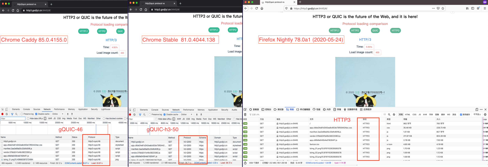

## quic-web

支持 QUIC 和 HTTP3 协议的 web 服务 Docker 镜像，Demo: [https://http3.godjiyi.cn:9445/](https://http3.godjiyi.cn:9445/)



[大图1](./_img/quic46.png)，[大图2](./_img/quic50.png)，[大图3](./_img/http3.png)

注：

* Chrome 浏览器目前仅支持自家的 QUIC，quic/46 是完全自家的，h3-Q050 这则是 gquic 逐渐向 IETF 规范靠拢；
* Firefox 浏览器则支持的是 IETF 官方 HTTP3，但 HTTP3 仍在草稿中，因此实现的是 HTTP3 各个阶段的 Draft 手稿协议。
* 详细说明 QUIC 和 HTTP3 区别见。

### 准备

* 一个域名，如：**http3.godjiyi.cn**;
* 域名证书，分别将 crt 和 key 文件重命名:
	* **domain.crt**
	* **domain.key** 

* 依赖 [http-base-quic](https://hub.docker.com/repository/docker/jiyiren/http-base-quic) 基础镜像;

### 使用

* 下载库和基础镜像

	```bash
	# 下载代码
	git clone https://github.com/jiyiren/quic-web.git
	# 下载基础镜像
	docker push jiyiren/http-base-quic:v1.0.0
	```

* 替换 `libs/ssl/` 下的证书;
* 配置 `httpd_config.conf`:

	* 只需配置 `httpd_config.conf` 的最后一段信息;
	* **address**: 为端口号，由于我们用了一层 Nginx 代理，这里不用修改;
	* **keyFile/certFile**: 如果大家上一步重名名了则不用变动，如果没有，则改为自己的 key/crt 名;
	* **map**: 只需要修改域名，如果你的域名为：xxx.aaa.com, 则改为：

		```nginx
		map                     http_proxy_quic xxx.aaa.com
		```
	* 完整示例:

		```nginx
		listener QUIC8443 {
		  address                 *:8443
		  secure                  1
		  keyFile                 /opt/ssl/domain.key
		  certFile                /opt/ssl/domain.crt
		  certChain               1
		  sslProtocol             28
		  renegProtection         1
		  sslSessionCache         1
		  sslSessionTickets       1
		  enableSpdy              15
		  enableQuic              1
		  map                     http_proxy_quic http3.godjiyi.cn
		}
		```
	
	
* 配置 `nginx.conf`:

	* 熟悉 nginx 配置的可忽略;
	* 主要配置域名和证书，如果严格按照上面步骤来，则只需要改下域名即可:

		```nginx
		server_name  http3.godjiyi.cn;
		```
	* www 路径，则大家只需将自己的站点放在 `libs/www/` 下面即可，如果不是，则自己修改根路径；
	* 完整示例代码里已经有注释说明了，大家可以参考。